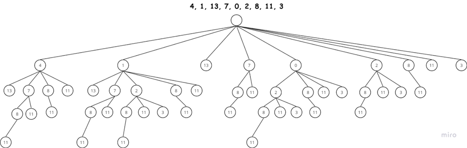
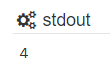
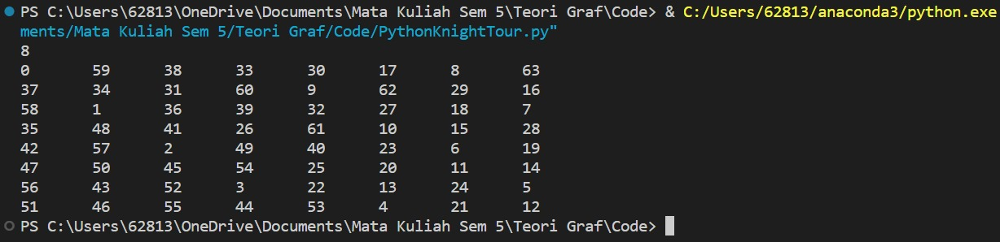

# Praktikum-Teori-Graf

| Nama           | NRP            |
| ---------------| ---------------|
| Abdullah Yasykur Bifadhlil Midror      | 5025211035      |
| Duevano Fairuz Pandya     | 5025211052      |
| Christian Kevin Emor     | 5025211153      |

# PPT 2
**Implementasikan sebuah program untuk menyelesaikan permasalahan “Longest Monotonically Increasing Subsequence”!**

**Solusi**
Longest Monotonically Increasing Subsequence merupakan suatu problem yang meminta kita untuk menemukan subsequence dari array / list / vector yang diberikan. Sebelumnya kita perlu tahu apa itu subsequence, subsequence merupakan kontainer yang bisa dibentuk dari suatu kontainer lain yang lebih besar. Berikut ini adalah contoh dari subsequence:

`sequence: 4, 1, 13, 7, 0, 2, 8, 11, 3`
`subsequence: {13, 7, 0, 2}, {4, 13}, {4, 1, 13},. . . , dsb.`

Jadi subsequence dapat dibentuk dari array sebelumnya dengan pola apapun. Dalam kasus `Longest Increasing Subsequence` kita diminta untuk mencari subsequence terpanjang yang dapat dibentuk dari indeks pertama hingga terakhir sequence yang diberikan. 

Berikut ini adalah contoh increasing subsequence dari sequence yang ada diatas:

`increasing subsequence: {4, 13}, {1, 13}, {1, 7, 8, 11}, dsb.`

dan berikut ini adalah contoh longest increasing subsequence yang kita harapkan:

`LIS: {1, 7, 8, 11}, {4, 7, 8, 11}, {1, 2, 8, 11}, dsb.`

dari sini dapat kita lihat bahwa LIS dari sequence di atas memiliki length 4. 

Untuk menyelesaikan problem ini, kita bisa menggunakan pendekatan tree. Pada penyelesaian nya kami menggunakan algoritma `Depth First Search` atau DFS. Dengan menggunakan DFS kita bisa lihat LIS dari branch atau cabang yang memiliki leaf paling dalam sebagai solusi dari LIS.
Jika memiliki sequence: 
`sequence: 4, 1, 13, 7, 0, 2, 8, 11, 3`
Berikut ini adalah tree yang dapat dibuat:

Berikut ini adalah kode penyelesaian dari problem LIS di atas:
https://ideone.com/BJqv5d

```cpp
#include <iostream> 
#include<vector>
using namespace std;

/// Longest Increasing Subsequence
// Kompleksitas Waktu O(n^2)

int LIS(vector<int> vec)
{
	int maxindex = 0; // menunjukkan posisi dari lis
	
	// first pair menunjukkan panjang lis untuk angka tersebut. second pair menunjukkan angka sebelumnya yang membuat lis.
	vector<pair<int , int>> lis(vec.size(), make_pair(1,0));
	
	int temp_maxindex = maxindex;
	for(int i=1; i<vec.size(); i++){
		if(vec.at(maxindex) < vec.at(i)){	// jika angka saat ini lebih besar dari angka lis sebelumnya, angka saat ini menjadi angka lis baru 
			lis.at(i).first = lis.at(maxindex).first + 1; 
			lis.at(i).second = maxindex; 
			maxindex = i;
			continue;
		} 
		
		for(int k=0; k<i; k++){ // temukan lis sebelumnya yang lebih kecil dari angka saat ini
			if(vec.at(i) > vec.at(k) && lis.at(i).first <= (lis.at(k).first+1)){
				lis.at(i).first = lis.at(k).first+1;
				lis.at(i).second = k;
			}
			if(lis.at(maxindex).first < lis.at(k).first ) maxindex = k;
		}
		
	}
	
	return lis.at(maxindex).first ;
}

int main(int argc, char *argv[]){
	vector<int> vec =   {4, 1, 13, 7, 0, 2, 8, 11, 3};    

	cout<<LIS(vec)<<'\n';
	
	return 0;
}
```


* int LIS(vector<int> vec): Ini adalah fungsi utama untuk mencari panjang LIS dari array input. Fungsi ini mengambil vektor integer sebagai parameter dan mengembalikan panjang LIS.
* int maxindex = 0;: Variabel maxindex digunakan untuk menyimpan indeks dari elemen terakhir dalam LIS saat ini.
* vector<pair<int , int>> lis(vec.size(), make_pair(1,0));: Vektor lis digunakan untuk menyimpan informasi tentang LIS pada setiap indeks. Setiap elemen dari vektor ini adalah pasangan nilai (length, prevIndex) yang menyatakan panjang LIS yang diakhiri pada indeks tersebut, dan prevIndex adalah indeks elemen sebelumnya yang membuat LIS pada indeks tersebut.
* for(int i=1; i<vec.size(); i++): Looping dimulai dari indeks kedua array karena pada indeks pertama, LIS-nya selalu 1 (hanya elemen itu sendiri).
* if(vec.at(maxindex) < vec.at(i)): Jika elemen saat ini lebih besar dari elemen di indeks maxindex, maka elemen saat ini menjadi elemen terakhir dalam LIS, dan panjang LIS pada indeks ini diperbarui.
* for(int k=0; k<i; k++): Looping ini mencari elemen sebelumnya yang lebih kecil dari elemen saat ini dan memperbarui panjang LIS jika ditemukan panjang yang lebih besar.
* Jika elemen saat ini lebih besar dari elemen di indeks k dan panjang LIS di indeks i kurang dari atau sama dengan (LIS di indeks k + 1), maka panjang LIS di indeks i dan prevIndex diindeks i diperbarui.
* Di dalam loop ini, juga diperbarui maxindex jika panjang LIS pada indeks maxindex lebih kecil dari panjang LIS pada indeks k.
* return lis.at(maxindex).first;: Mengembalikan panjang LIS pada indeks maxindex.
* int main(int argc, char *argv[]): Fungsi main sebagai fungsi eksekusi utama.
* vector<int> vec = {4, 1, 13, 7, 0, 2, 8, 11, 3};: Mendefinisikan vektor vec sebagai contoh array untuk diuji.
* cout<<LIS(vec)<<'\n';: Mencetak panjang LIS dari array vec ke layar.

**Output**<br>



# PPT 3

> Jika sebuah bidak kuda diletakkan pada sebarang kotak untuk kemudian melakukan perjalanan (dengan cara pergerakan kuda) mengunjungi ke semua (8 x 8) kotak papan catur.
> Jika diinginkan situasi bahwa kuda tsb dapat:
> Jika sebuah bidak kuda diletakkan pada sebarang kotak untuk kemudian melakukan perjalanan (dengan cara pergerakan kuda) mengunjungi ke semua (8 x 8) kotak papan catur.
> Jika diinginkan situasi bahwa kuda tsb dapat:
> - Mengakhiri perjalanan pada attacking square (closed tour);
> - Mengakhiri perjalanan di sebarang kotak (open tour);
> Maka aplikasikan algoritma untuk menyelesaikan masalah di atas ke dalam sebuah program dengan menunjukkan rute perjalanan seperti gambar kanan bawah.
> 
> 


### - Mengakhiri perjalanan pada attacking square (closed tour)
```py
import random

# class untuk current_tile
class CurrentTile:
	def __init__(self, x, y):
		self.x = x
		self.y = y

# ukuran current_tile
N = 8

# moves knight
moves_x = [1, 1, 2, 2, -1, -1, -2, -2]
moves_y = [2, -2, 1, -1, 2, -2, 1, -1]

# cek apakah tile masih ada didalam current_tile (legal moves)
def isLegal(x, y):
	return ((x >= 0 and y >= 0) and (x < N and y < N))

# Checks apakah tiles berada dalam current_tile dan kosong
def isempty(tour, x, y):
	return (isLegal(x, y)) and (tour[y * N + x] < 0)

# Cari jumlah tiles kosong yang adjacent (degree dari knight graph)
def getDegree(tour, x, y):
	count = 0
	for i in range(N):
		if isempty(tour, (x + moves_x[i]), (y + moves_y[i])):
			count += 1
	return count

# pilih next move berdasarkan Warnsdorff's heuristic
# return false jika tidak bisa memilih
def nextMove(tour, CurrentTile):
	min_degree_index = -1 # untuk menyimpan index dengan minimum degree
	degree = 0
	min_degree = (N + 1)  # minimum degree
	next_moves_x = 0
	next_moves_y = 0

	# randomize moves
	# cari degree next moves hasil randomize
	# lakukan 8 kali dan dapatkan next moves dengan minimum degree
	start = random.randint(0, 1000) % N
	for count in range(0, N):
		i = (start + count) % N
		next_moves_x = CurrentTile.x + moves_x[i]
		next_moves_y = CurrentTile.y + moves_y[i]
		degree = getDegree(tour, next_moves_x, next_moves_y)
		if ((isempty(tour, next_moves_x, next_moves_y)) and degree < min_degree):
			min_degree_index = i
			min_degree = degree

	# Jika tidak ditemukan next moves
	if (min_degree_index == -1):
		return None

	# tiles next_moves
	next_moves_x = CurrentTile.x + moves_x[min_degree_index]
	next_moves_y = CurrentTile.y + moves_y[min_degree_index]

	# Masukkan next moves ke tiles
	tour[next_moves_y * N + next_moves_x] = tour[(CurrentTile.y) * N + (CurrentTile.x)] + 1

	# Update currentTile
	CurrentTile.x = next_moves_x
	CurrentTile.y = next_moves_y

	return CurrentTile

# displays the chesscurrent_tile with all the isLegal knight's moves
def print_tour(tour):
	for i in range(N):
		for j in range(N):
			print("%d\t" % tour[j * N + i], end="")
		print()

# cek apakah neighbor node nya adalah starting_node
def neighbour(x, y, start_x, start_y):
	for i in range(N):
		if ((x + moves_x[i]) == start_x) and ((y + moves_y[i]) == start_y):
			return True
	return False

# Generates the isLegal moves using warnsdorff's heuristics. Returns false if not possible
def findClosedTour(start_x, start_y):
	# Tour array
	tour = [-1] * N * N

	# buat current_tile
	current_tile = CurrentTile(start_x, start_y)

	tour[current_tile.y * N + current_tile.x] = 1 # First move

    # Cari next move dengan menggunakan Warnsdorff's heuristik
	next_tile = None
	for i in range(N * N - 1):
		next_tile = nextMove(tour, current_tile)
		if next_tile == None:
			return False

	# cek apakah tour closed (neighbor node dari next-tile adalah starting node)
	if not neighbour(next_tile.x, next_tile.y, start_x, start_y):
		return False
	
	print_tour(tour)
	return True


# Driver Code

# initial position
start_x = 7
start_y = 7

## Hamiltonian Cycle
# loop sampai ketemu solusi
while not findClosedTour(start_x, start_y):
	continue
```

Algoritma backtracking adalah algoritma pencarian yang digunakan untuk memecahkan masalah yang dapat direpresentasikan sebagai pohon keputusan. Algoritma ini bekerja dengan cara mengeksplorasi semua kemungkinan cabang di pohon keputusan hingga menemukan solusi yang valid. Pada masalah perjalanan kuda, pohon keputusan dapat direpresentasikan sebagai berikut:
> - Akar: Posisi kuda awal
> - Cabang: Langkah kuda berikutnya
> - Daun: Posisi kuda yang telah mengunjungi semua kotak di papan catur
Algoritma backtracking akan mengeksplorasi semua kemungkinan langkah kuda hingga menemukan daun yang valid. Jika tidak ada daun yang valid, maka algoritma akan gagal.

Heuristik Warnsdorff adalah heuristik yang digunakan untuk memprediksi langkah kuda berikutnya yang paling mungkin menghasilkan solusi closed tour. Heuristik ini bekerja dengan cara menghitung jumlah tetangga kosong yang belum dikunjungi dari setiap posisi kuda. Pada masalah perjalanan kuda, heuristik Warnsdorff dapat digunakan untuk mengoptimalkan algoritma backtracking sebagai berikut:
> - Langkah pertama kuda: Kuda selalu bergerak ke arah yang memiliki jumlah tetangga kosong paling sedikit.
> - Langkah berikutnya: Kuda akan mencoba ke arah yang memiliki jumlah tetangga kosong paling sedikit, kecuali jika arah tersebut sudah pernah dikunjungi.
> - Jika semua arah sudah pernah dikunjungi, kuda akan mencoba ke arah yang memiliki jumlah tetangga kosong paling sedikit.
Dengan menggunakan heuristik Warnsdorff, algoritma backtracking dapat menemukan solusi closed tour lebih cepat.

Lalu bagaimana algoritma backtracking dengan optimasi menggunakan heuristik Warnsdorff dapat menyelesaikan persoalan perjalanan kuda dengan closed tour?
1. Algoritma dimulai dengan mengeksplorasi cabang yang mewakili langkah kuda pertama.
2. Jika cabang ini tidak menghasilkan solusi closed tour, maka algoritma akan mengeksplorasi cabang berikutnya.
3. Algoritma akan terus mengeksplorasi cabang-cabang berikutnya hingga menemukan cabang yang menghasilkan solusi closed tour.
4. Heuristik Warnsdorff digunakan untuk mengoptimalkan algoritma backtracking dengan cara memprediksi langkah kuda berikutnya yang paling mungkin menghasilkan solusi closed tour. Dengan menggunakan heuristik Warnsdorff, algoritma backtracking dapat menemukan solusi closed tour lebih cepat.

untuk struktur dari codingan berikut adalah penjelasan singkat dari codingan kami:
- Kelas CurrentTile: Digunakan untuk menyimpan posisi (x, y) kuda saat ini.
- N = 8: Ukuran papan catur (8x8).
- Variabel moves_x dan moves_y: Mendefinisikan 8 kemungkinan arah gerakan kuda.
- Fungsi isLegal: Mengecek apakah posisi kandidat berada di dalam papan catur.
- Fungsi isempty: Mengecek apakah posisi kandidat kosong (belum dikunjungi).
- Fungsi getDegree: Menghitung jumlah tetangga kosong yang belum dikunjungi (menggunakan heuristik Warnsdorff).
- Fungsi nextMove: Mencari langkah selanjutnya dengan prioritas ke arah yang memiliki minimal tetangga kosong dan masih legal (menggunakan heuristik Warnsdorff).
- Fungsi print_tour: Menampilkan rute perjalanan kuda pada papan catur.
- Fungsi neighbour: Mengecek apakah posisi kandidat adalah tetangga dari titik awal.
- Fungsi findClosedTour: Menjalankan proses pencarian rute dengan backtracking dan heuristik Warnsdorff, mengembalikan True jika solusi ditemukan dan False jika tidak.
- Looping utama: Mencari solusi berulang kali hingga ditemukan rute closed tour yang valid.

Saat initial position kita definisikan sebagai start_x = 7 dan start_y = 7 mendefinisikan bahwa kuda akan berada di posisi pojok kanan bawah dan didapatkan output sebagai berikut


kuda akan berada di posisi (7,7) dimana diwakili angka 1 dan akan terus bergerak hingga di posisi terakhir yaitu 64 yang merupakan posisi terakhir dari papan catur 8x8


### - Mengakhiri perjalanan di sebarang kotak (open tour)
```py
def isSafe(x, y, board): 
	''' 
		A utility function to check if i,j are valid indexes 
		for N*N chessboard 
	'''
	if(x >= 0 and y >= 0 and x < n and y < n and board[x][y] == -1): 
		return True
	return False


def printSolution(n, board): 
	''' 
		A utility function to print Chessboard matrix 
	'''
	for i in range(n): 
		for j in range(n): 
			print(board[i][j], end=' ') 
		print() 


def solveKT(n): 
	''' 
		This function solves the Knight Tour problem using 
		Backtracking. This function mainly uses solveKTUtil() 
		to solve the problem. It returns false if no complete 
		tour is possible, otherwise return true and prints the 
		tour. 
		Please note that there may be more than one solutions, 
		this function prints one of the feasible solutions. 
	'''

	# Initialization of Board matrix 
	board = [[-1 for i in range(n)]for i in range(n)] 

	# move_x and move_y define next move of Knight. 
	# move_x is for next value of x coordinate 
	# move_y is for next value of y coordinate 
	move_x = [2, 1, -1, -2, -2, -1, 1, 2] 
	move_y = [1, 2, 2, 1, -1, -2, -2, -1] 

	# Since the Knight is initially at the first block 
	board[0][0] = 0

	# Step counter for knight's position 
	pos = 1

	# Checking if solution exists or not 
	if(not solveKTUtil(n, board, 0, 0, move_x, move_y, pos)): 
		print("Solution does not exist") 
	else: 
		printSolution(n, board) 


def solveKTUtil(n, board, curr_x, curr_y, move_x, move_y, pos): 
	''' 
		A recursive utility function to solve Knight Tour 
		problem 
	'''

	if(pos == n**2): 
		return True

	# Try all next moves from the current coordinate x, y 
	for i in range(8): 
		new_x = curr_x + move_x[i] 
		new_y = curr_y + move_y[i] 
		if(isSafe(new_x, new_y, board)): 
			board[new_x][new_y] = pos 
			if(solveKTUtil(n, board, new_x, new_y, move_x, move_y, pos+1)): 
				return True

			# Backtracking 
			board[new_x][new_y] = -1
	return False


# Driver Code 
if __name__ == "__main__": 
	# Function Call
    n = input()
    n = int(n)
    solveKT(n) 
```

Algoritma backtracking bekerja secara inkremental untuk menyelesaikan masalah. Biasanya, kita memulai dengan vektor solusi kosong dan satu per satu menambahkan elemen (artinya elemen ini bervariasi tergantung pada masalah yang dihadapi. Dalam konteks masalah tour Knight, elemen ini adalah langkah dari Knight). 

Ketika kita menambahkan elemen, kita memeriksa apakah penambahan elemen saat ini melanggar batasan masalah; jika ya, kita menghapus elemen tersebut dan mencoba alternatif lain. Jika tidak ada alternatif yang berhasil, kita kembali ke tahap sebelumnya dan menghapus elemen yang ditambahkan pada tahap sebelumnya. Jika kita kembali ke tahap awal, kita menyatakan bahwa tidak ada solusi yang ada. Jika penambahan elemen tidak melanggar batasan, kita secara rekursif menambahkan elemen satu per satu. Jika vektor solusi menjadi lengkap, kita mencetak solusi tersebut.

Berikut adalah algoritma backtracking untuk masalah tour Knight:
```
If semua kotak sudah dikunjungi,
    cetak solusinya.
Else,
   a) Tambahkan salah satu langkah berikutnya ke vektor solusi dan secara rekursif
   periksa apakah langkah ini mengarah ke solusi. (Sebuah Knight dapat membuat maksimum
   delapan langkah. Kami memilih salah satu dari 8 langkah pada langkah ini).
   b) Jika langkah yang dipilih pada langkah sebelumnya tidak mengarah ke solusi,
   maka hapus langkah ini dari vektor solusi dan coba alternatif lain.
   c) Jika tidak ada alternatif yang berhasil, kembalikan false (Mengembalikan false
   akan menghapus item yang ditambahkan sebelumnya dalam rekursi dan jika false
   dikembalikan oleh panggilan rekursi awal, maka "tidak ada solusi yang ada").
```
Berikut penjelasan singkat struktur kodingan dari kelompok kami.
- Fungsi `isSafe()` adalah fungsi bantu yang memeriksa apakah posisi yang diberikan `(x, y)` di papan catur adalah langkah yang valid untuk kuda. Fungsi ini mengembalikan `True` jika langkahnya valid, dan `False` sebaliknya.
- Fungsi `printSolution()` adalah fungsi bantu untuk mencetak matriks papan catur.
- Fungsi `solveKT()` adalah fungsi utama yang menginisialisasi papan catur, mendefinisikan kemungkinan langkah kuda, dan memanggil fungsi bantu `solveKTUtil()` untuk memecahkan masalah Tur Kuda.
- Fungsi `solveKTUtil()` adalah fungsi bantu rekursif yang mencoba untuk menemukan solusi untuk masalah Tur Kuda menggunakan backtracking. Fungsi ini mencoba semua langkah yang mungkin dan secara rekursif menjelajahi ruang solusi.
- Terakhir, kode pengendali mengambil input untuk ukuran papan catur (`n`) dan memanggil fungsi `solveKT()` untuk menemukan dan mencetak solusi Tur Kuda.

Berikut adalah rute kuda pada papan catur yang dihasilkan dari kode tersebut

